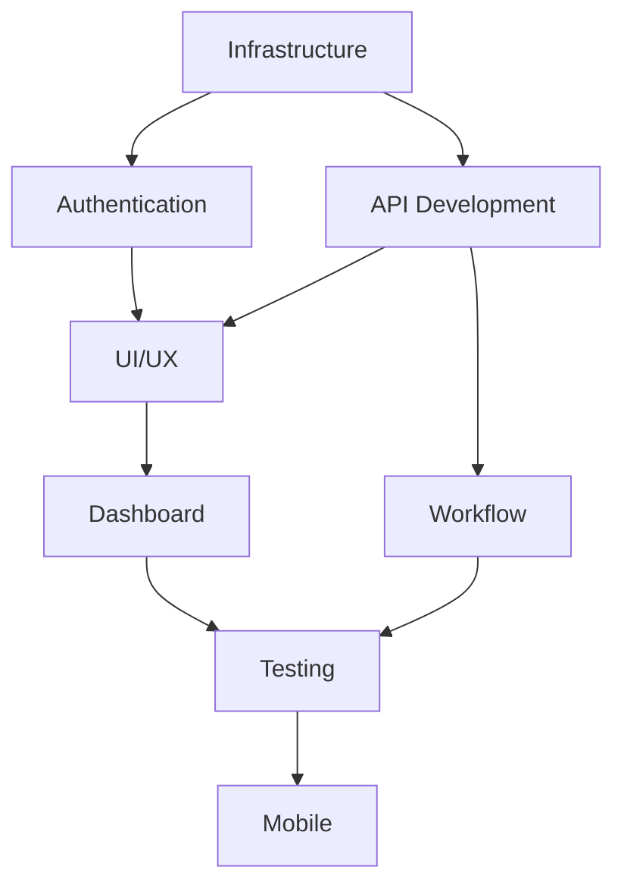

# 🤖 CodigoFacil CRM - Subagents Overview

This document outlines the specialized subagents for developing the CodigoFacil CRM system. Each agent focuses on specific technical domains to ensure efficient and organized development.

## 📋 Agent Structure

Each agent has:
- **Clear scope and responsibilities**
- **Technical expertise in their domain**
- **Specific deliverables and tasks**
- **Integration points with other agents**

## 🚀 Agent Execution Order

### Phase 1: Foundation (Critical Path)
1. **Infrastructure Agent** - Database, environment, core setup
2. **Authentication Agent** - Security and user management
3. **API Development Agent** - Backend CRUD operations

### Phase 2: Core Features
4. **UI/UX Agent** - Frontend components and forms
5. **Dashboard Agent** - Real-time data and analytics

### Phase 3: Advanced Features
6. **Workflow Agent** - CRM business logic and automation
7. **Testing Agent** - Quality assurance and monitoring

### Phase 4: Polish
8. **Mobile Agent** - Cross-platform optimization

## 📁 Agent Files

- `agents/infrastructure-agent.md` - Database, environment, setup
- `agents/authentication-agent.md` - Security, users, sessions
- `agents/api-development-agent.md` - Backend APIs and validation
- `agents/ui-ux-agent.md` - Frontend components and UX
- `agents/dashboard-agent.md` - Analytics and visualization
- `agents/workflow-agent.md` - CRM workflows and automation
- `agents/testing-agent.md` - Testing, monitoring, quality
- `agents/mobile-agent.md` - Mobile and accessibility

## 🔗 Cross-Agent Dependencies

## 🎯 Quick Start

1. Begin with Infrastructure Agent to set up the foundation
2. Move to Authentication Agent for security
3. Develop APIs with API Development Agent
4. Build UI components with UI/UX Agent
5. Continue with remaining agents based on priority

## 📞 Agent Coordination

- Each agent should document integration points
- Shared components go in `/src/components/shared/`
- Common utilities in `/src/lib/shared/`
- API contracts documented in `/docs/api/`